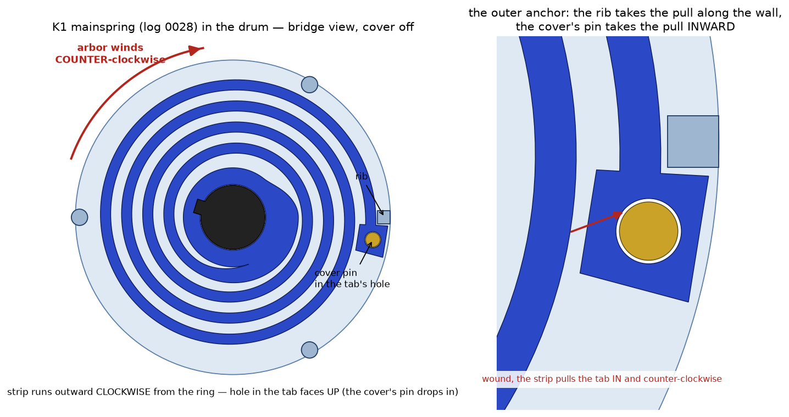
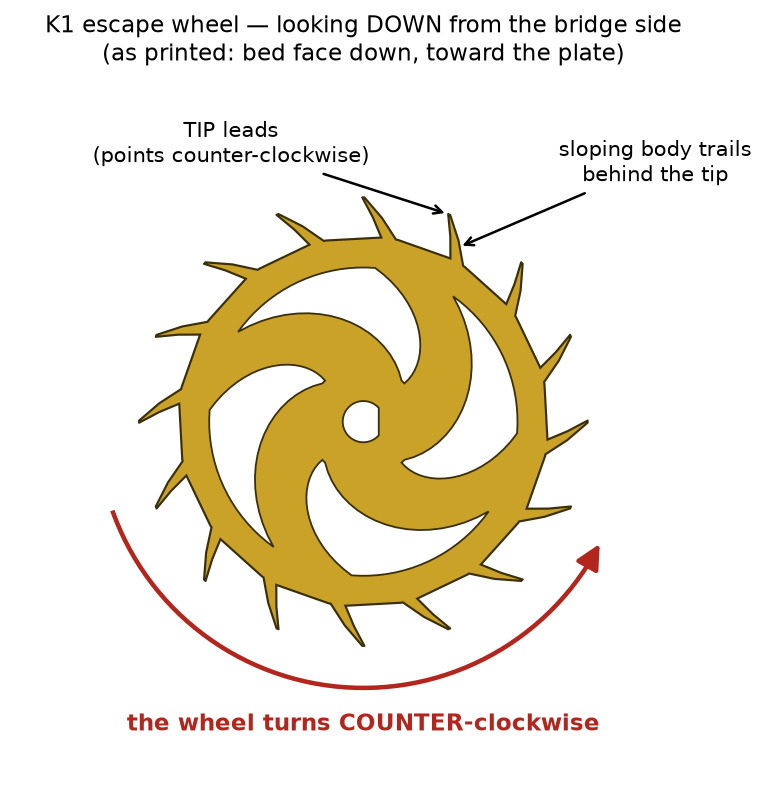

# Caliber K1 rev C — assembly guide (print variant)

How the pile of printed parts becomes a ticking movement. Every stage
ends with a **gate** — do not pass a stage until its gate passes; every
downstream mystery starts as an upstream skip. Print settings and
support cleanup live in the [printing guide](printing-guide.md); the
part list and orientations in the
[print-kit manifest](../../exports/k1/print/MANIFEST.md).

**Hardware:** M3×18 ×6 + nuts (bridge pillars ×4, cock feet ×2) ·
M3×20 ×3 + nuts (stand feet) · M3 nuts ×16 more (balance timing
weights) ·
*No ×18 in your kit? **×20 + ~2 mm of flat washers under the head** is
an exact substitute (full nut engagement, tip clear of the dial sheet).
**×16 is not** — it catches ~1.4 threads of the nut and will strip.
Bare ×20 threads fine but its tip stands 2.3 proud of the dial face at
r70–74, exactly where the dial sheet lands at the dial stage.* ·
**M2×6 thread-forming ×6** — ONE screw for every M2 hole (bay strap ×2,
click ×1, dial platform ×3) · Super Lube (PTFE grease).

**The M2 screw, specifically:** McMaster-Carr **94209A343** — steel
Phillips pan-head *thread-forming* screw, M2×6, tri-lobular Taptite®
shank with an unthreaded lead-in, pkg of 100 ($9). Every M2 pilot in
the movement is sized for this one part (log 0026), so there is no
"which length goes where." Do NOT substitute sharp-tipped sheet-metal
self-tappers or M2 machine screws: the pilots are Ø1.6–1.8 so a
thread-FORMER can displace its own thread; a cutter shaves the wall and
loosens on the second service, a machine screw won't start. Any true
plastic thread-former (PT / Delta-PT, M2×6, pan head) is an equal
substitute if you have one.

**Tools:** calipers, fine tweezers, hobby knife, small screwdrivers
(#0 Phillips for the M2s), a soft mat. No press needed — every
press-fit here is thumb or gentle-tap.

**Two PLA rules.** Thread-forming M2s into PLA: stop at snug — a
quarter turn past snug strips the boss. And never twist a part off a
press fit; pull straight, or you shear the printed key flats.

Orientation language: "bridge side" is the side with the wave bridge
(z-up in the CAD); "dial side" is the face with the pockets. Assembly
happens bridge-side-up until Stage 7 says otherwise.

---

## Stage 0 — prep and dry fit

1. Deburr every pivot (the Ø2.5 arbor ends) and scrape support witnesses
   flat. Roll each pivot between your fingers feeling for flare.
2. Dry-fit each train arbor's lower pivot in its mainplate bushing —
   it must spin freely with no rock. Fix with light knife scrapes now,
   not under the bridge later.
3. Grease discipline for the whole build: a dab the size of a grain of
   rice per pivot cup or bushing, applied with a toothpick. More is not
   better — PLA + excess grease collects debris.

**Gate:** every arbor spins free in its plate bushing, held vertical by
fingers.

## Stage 1 — the barrel

1. Lay the **mainspring** (PETG, log 0028) into the open **drum**,
   **hole side UP** (the blind hole is in the outer tab's top face).
   Right way up, the strip leaves the inner ring and spirals outward
   **clockwise** as you look into the drum. Upside down it is the other
   hand: winding forces the coils out against the wall instead of
   drawing them in onto the ring, which is how the first spring broke.
2. Turn the spring so its outer **tab** sits just clockwise of the
   small **rib** on the drum's inner wall, nearly touching — the rib
   takes the tangential pull on the tab's counter-clockwise face. It
   will feel loose: a tab on a wall rib has nothing to stop it sliding
   inward (that is what you saw when the old spring "popped off the
   nub"). The cover's pin does that job in step 4.
3. Drop the **barrel_arbor** down the center, its hub rib into the
   **keyway** in the spring's inner ring — the ring is a snug slide
   over the hub and the keyway is the only place the rib goes. Rotate
   the arbor until it drops.
4. **drum_cover** (log 0028: it has a Ø2.5 pin on its underside) onto
   the three wall lugs, **pin into the hole in the spring's tab** —
   turn the cover until the pin finds the hole and the cover lands
   flush at the drum mouth. That pin is the outer anchor; without it
   the first turn of wind pulls the tab off the rib.
5. Grease the plate's barrel recess floor cup, and seat the barrel unit
   in the recess — arbor's lower cup pivot into the blind cup.

   

**Gate:** hold the drum, turn the arbor's square **counter-clockwise**
(looking into the drum from the cover side): resistance grows smoothly
for a turn and springs back when released. Clockwise it should bind
within a fraction of a turn (the coils have nowhere to go but the
wall). If it is the other way round — smooth clockwise, binding
counter-clockwise — the spring is in upside down. The drum itself
spins freely in the recess. *Do not wind to solid here: the arbor
square is 4 mm of PLA and the knob (Stage 5) spreads the load.*

*The arbor's square changed in log 0027: it is now solid and 3.4 tall
(the first was 1.6 tall and hollow, and the ratchet climbed off it
under load). If yours has a square hole in its top, reprint it before
winding.*

## Stage 2 — the going train

Grease each bushing first (rice grain, toothpick).

1. **minute_arbor** — long dial stub DOWN through the central through-bore
   (only arbor that pierces the plate).
2. **third_arbor**, **fourth_arbor** into their blind bushings.
3. **escape_arbor** — bay-cup pivot down into the escapement bay's floor
   cup; the D-seat rides low in the bay.

**Gate:** the chain meshes by eye — drum 60t → minute pinion, minute
wheel → third pinion, third wheel → fourth pinion, fourth wheel → the
escape arbor's 18t pinion up top. Then the test that matters: **one
finger on the drum rim turns the whole train.** Firm is fine — friction
downstream reflects back to the barrel ×48, so this is the stiffest
place to push — but a lock-up here means the mainspring can't run it
either. (Turning from the minute arbor feeling much easier is the same
arithmetic in reverse, not a fix.)

**If it binds from the barrel:** (1) scrape support fuzz off the drum
band's tooth flanks and off the minute wheel's underside — the wheel
overhangs the drum cover by design and any fuzz there drags ×6; (2)
check the drum is fully seated and the cover flush on its lugs; (3)
thin-grease the tooth flanks of the first two meshes, not just pivots;
(4) run in: drive a hundred turns from the minute arbor (the easy
direction), wipe the debris, re-grease, retest. Printed flanks burnish
noticeably in their first minutes. Still locking → the teeth printed
fat and are eating the designed backlash: bump the print variant's
backlash and reprint the minute arbor before fighting it further.

## Stage 3 — the escapement

1. **escape_wheel** presses onto the escape arbor's D-seat — firm push
   until it butts the shoulder (the diameter step above the seat). It
   should need real thumb pressure: that's the drive fit. The short
   pivot protrudes through the wheel below — correct.
   **Which way up matters:** the D-bore lets it go on either face.
   Looking down from the bridge side, the tooth tips must point
   COUNTER-clockwise — the direction the wheel turns. Each tooth's tip
   leads and its sloping body trails behind it. If you printed it the
   way the STL imports, that is bed face DOWN, toward the plate.

   
2. **pallet_fork** — lower (long) pivot into its greased bay-floor cup.
   The fork's horns face the balance side; it can only reach the wheel
   one way.
3. **bay_strap** over the fork's upper pivot (blind cup underneath),
   2× M2×6 into the plate pilots through the strap's two raised foot
   bosses. Snug, not tight. The bosses are what let the 6 mm screw
   run fully home over the shallow near-side pilot, and they hold the
   heads 0.25 mm clear of the balance rim — so if a head ever looks
   like it's touching the balance, the strap is on backwards or a
   boss printed short.

**Gate:** the tweezers test, with two or three teeth of wind on the
barrel. The fork must sit against one banking pin and STAY there — the
wheel is locked on a stone and pulls the fork onto its pin (draw).
Nudge the fork toward centre with tweezers: for the first couple of
degrees it pushes back (the wheel is being forced backward), then it
lets go, the wheel advances half a tooth and throws the fork across to
the other pin, where it locks again. Tick. Nudge it back: tock. Each
nudge = half a pitch (11.25 deg); one full tooth per back-and-forth.
What is NOT correct: the fork flopping between the pins on its own
with the wheel running, or the wheel spinning several teeth free on
one nudge. Both mean a stone is not locking — an old wheel or fork
(see the manifest), a support nub under a stone, or a short print on
the fin. *(Before log 0027 this gate said the escapement would "step
in a rapid buzz" without a balance. It did, and that was the fault.)*

## Stage 4 — the bridge (the four-pivot landing)

1. **Stem first — it cannot go in later** (bench-caught): with the
   bridge in hand, slide the **stem_and_crown** into the tunnel from
   outside, press the **winding_pinion** onto the D-tip from the
   underside until it butts the tunnel's inner face, and snap the
   **stem_clip** into its groove. The pinion press needs finger room
   under the web, which mounting the bridge removes forever.
2. Grease the four train top-pivot holes and the barrel-arbor bearing in
   the bridge web.
3. Rest the **bridge_wave** on its four rim pillars and walk the pivots
   into the cone lead-ins: minute, third, fourth, escape, plus the
   barrel arbor's column into the web bearing. Patience beats force —
   when the bridge sits flush on all four pillars, everything is home.
4. 4× M3×18 down the pillars into the hex nuts in their dial-side
   pockets (no ×18? **×20 + ~2 mm of washers under the head** — see the
   substitution note in Hardware; ×16 strips the nut). Alternate
   corners, snug only.

**Gate:** with the fork out, spin the drum by hand — the train runs
down through the escape wheel freely, no new friction versus Stage 2.
With the fork in, the train must NOT run: the wheel locks on a stone
and stays until the fork is nudged (Stage 3's gate).

## Stage 5 — winding

> **Oct 2026: the crown-and-stem train does not work as drawn** — three
> measured faults, [log 0027](../log/0027-keyless-works-autopsy.md).
> Until it is redesigned, wind by hand at the barrel: fit the bench
> knob (`exports/k1/print/bench/winding_knob.stl`, README beside it)
> in place of the plain ratchet in step 1, leave the crown wheel and
> its stud OUT, and skip steps 3 and 4. Those steps describe the crown
> train as designed and are kept for the redesign.

1. **ratchet** (or the winding knob) onto the barrel arbor's square.
   Its lower half sits in the bridge-top pocket; the rest stands 1.8
   proud. The fit on the square is snug on purpose — press it fully
   down. **Winding turns it COUNTER-clockwise as you look down at the
   bridge**, and the click blocks it clockwise.
2. **click** (PETG): pegs down into their two holes, block into its
   pocket, until the click's flat plate sits on the bridge's top
   surface. M2×6 down the counterbore into the cone-shaped boss under
   the web. **Drive the screw slowly and stop when the head seats.**
   Then check the pawl: push its hooked end outward with a fingernail
   — it should swing about 2 mm on its thin neck and spring back into
   the teeth. If it does not move freely, there is a string of PETG
   bridging the gap between the pawl and the plate; cut it.
   *(The long curved pocket beside the ratchet is the first click's
   arm channel. It stays empty now — the click works above the bridge
   so that nothing limits how far it can lift.)*
   *(Bridges printed before coda 5 rev 8 have a slim Ø4.8 cylinder
   under the web instead of the cone; it twists off under this screw —
   reprint the bridge rather than glue it.)* **If the peg holes are
   scarred** (the pocket prints face-down): twist a Ø2.5 drill bit
   into them by hand before seating the click, stopping at the floor
   — on the cone-boss bridge the peg holes are blind, 1.3 deep.

**Gate (with the knob):** turn it counter-clockwise: the click ticks
over each tooth. Let go: the click holds. **Wind until the spring goes
solid and stop there** — the log-0028 spring is sized so that solid is
inside the PETG's safe strain (the kit's 1.7 strip: about 27 teeth,
1.1 turns; the bench README has the table for the other two strips,
and the 2.0 strip stops at 20 teeth, short of solid). Never force past
solid: everything in the barrel is loaded hardest there.

3. **crown_wheel** flat in its pocket, bevel slots DOWN, spur rim
   meshing the ratchet; press the **crown_stud** through its counterbore
   into the web bore — the mushroom head retains the wheel, flush.
4. The stem is TWO pieces now (coda 5 rev 4 — the one-print stem
   physically could not enter the tunnel; if yours has the pinion
   attached, it is the obsolete part). Order matters:
   1. **stem_and_crown** slides in from OUTSIDE the rim, D-flat tip
      leading, until the crown nears the rim. No force anywhere.
   2. **winding_pinion** presses onto the D-tip from INSIDE (flat side
      toward the tunnel) until it butts the tunnel's inner face —
      that face is its thrust shoulder. Firm thumb press on the D.
   3. Snap the **stem_clip** (PETG) up into the slot inside the tunnel
      run, into the stem's groove.
   Check: the crown spins with light drag and has almost no in-out
   play; its pinion teeth sit in the crown wheel's underside slots.

**Gate:** wind at the crown: crown → crown wheel → ratchet → arbor, the
click ratcheting tooth by tooth. Release the crown — the click HOLDS
the wind, and the train buzzes the charge down through the escapement.
You have a motor. (Hands set by finger later — the crown only winds.)

## Stage 6 — the balance (it ticks)

Let the mainspring down completely first, and make sure the pallet
fork and its strap are in (Stage 3).

Build the balance package on the bench. The **staff** is the balance's
axle: a plain Ø3 rod, 13.8 long — printed, or better, cut from metal
rod (13.6–14.0 is fine; never longer, or the cock pinches it). Square
both ends, take the burr off, and round them very slightly: they are
the bearing surfaces.

The roller, balance wheel and hairspring **grip the staff by
friction** — they must turn with it, not on it. They should press on
with firm thumb pressure. If one will not start, open its hole a
little at a time with a round needle file or rolled sandpaper and try
again; do not drill it out to 3.0, and do not force it (the hub
splits). If one ends up loose: a drop of superglue for the roller or
the wheel, but leave the hairspring's collet as a friction fit — it
is how the beat is adjusted.

Measure each seat height **from the staff's lower tip**:

| part | seats at | orientation |
|---|---|---|
| roller | tier bottom **1.9 mm** up | crescent tier DOWN, impulse pin up |
| balance_wheel | ring bottom **5.3 mm** up | nut pockets UP |
| hairspring collet | **9.4 mm** up | stud tab reaching outward |

1. Press an **M3 nut** into each of the 16 hex pockets in the balance
   wheel's rim (flat-nose pliers or a small vise) until it sits below
   the rim's face. Nothing may stand proud of the rim on either side:
   the hairspring passes 0.7 mm above it and the pallet strap 0.5 mm
   below. A nut that is loose gets a drop of superglue.
2. Press roller, wheel, hairspring onto the staff at those heights.
3. Grease the bay's balance cup. Lower the package in — staff tip in
   the cup, and rotate so the **impulse pin sits inside the fork's
   slot** (pin between the horns; the guard finger rides the crescent).
4. A dab of grease in the blind cup under the **balance_cock**'s arm —
   its floor is the staff's upper endstone.
5. Cock over: cup onto the staff's top end, the hairspring's stud ring
   dropping over the cock's hanging stud post. 2× M3×18 through the
   feet columns into their dial-side nuts (same ×20-plus-washers
   substitute as the bridge pillars).
6. Lift the balance with tweezers: it should rise about 0.3 mm and
   drop back. No play at all = the staff is too long; file 0.1–0.2 off.

**Gate:** the first tick. Wind 6 teeth to start and add 6 at a time —
too much shows as the balance swinging very wide and knocking at the
ends of its swing; too little, it stalls. Note the teeth it first runs
on: that number sizes the real winding mechanism. The balance should take up
oscillation and run — a stately ~1 s beat (16t wheel, 0.53 Hz). If it
stalls: check endshake (balance must have visible up-down float, not
pinched by the cock), then beat (below).

**Beat adjustment:** at rest with zero wind, the fork should sit midway
between its bankings. If it rests against one pin, grip the balance
rim, and rotate the hairspring **collet** on the staff (the slit makes
it a friction clutch) a few degrees, and retest. Even "tick—tock"
spacing by ear is the goal.

## Stage 7 — the dial side (time appears)

Flip the movement — rest it bridge-down on a soft mat (the cock and
bridge take the weight; the balance survives this, but don't press).

1. **Posts first** (the axles): **center_post** (Ø3) into the center
   bore; the six **arbor posts** (Ø2 — printed or your cut brass pins)
   into their bores: motion, w1, w2, disc, i1, i2. Press flush-bottomed;
   tips stand 0.7 proud of the face — they locate everything later.
2. **transfer_pinion** (PETG): its slit collet presses onto the minute
   arbor's round stub. This friction joint IS hand-setting — running
   torque carries, setting torque slips.
3. **transfer_idler** ×2 onto posts i1/i2, meshing pinion→idler→idler.
4. **motion_arbor** onto its post.
5. **cannon** over the center post — its deep gears (12t + 16t transfer
   tail) go down into the pockets; the 16t meshes the second idler.
6. **hour_wheel** sleeves over the cannon's pipe — 40t meshing the
   motion arbor's 10t, integral 24t moon pinion riding above.
7. Moon train: **moon_w2** onto its post, **moon_w1** onto its post
   (36t meshing the hour pipe's 24t), then the **moon_disc** — and set
   the moons to today's phase before covering (you can nudge it through
   the window later, but now is easy).
8. **dial_platform** over everything, located by the six post tips,
   3× M2×6 into the plate (5.5 mm pilots — the same screw as
   everywhere). It closes every pocket — nothing should rattle.
9. **dial_sheet** onto the platform, located by the same post tips,
   center pierced by the hour pipe.
10. Hands at **12:00 both**: hour_hand onto the hour pipe's seat,
    minute_hand onto the cannon's flat seat. Press straight down.

**Gate:** turn the minute hand gently clockwise — it slips at the
transfer collet with silky resistance, the hour hand follows at 1/12
speed, and nothing inside clicks or catches. Set to the current time.

## Stage 8 — stand it up and regulate

1. 3× **stand_foot** at the plate rim, M3×20 + nuts.
2. Full wind. Set time. Let it run.
3. **Rate trim** (the point of the timing screws): time it against your
   phone over an hour. Running slow → shorter/lighter rim screws (less
   inertia = faster). Running fast → longer/heavier screws. Always move
   opposite pairs together to keep the balance poised. Expect to trim —
   every spool of filament has its own stiffness; the screws exist
   because of that.

**Final gate:** a full wind runs the movement down over hours, not
minutes, keeping visible time against your phone. Welcome to horology.

---

## Serviceability (by design — use it)

- **Fork out:** 2× M2 off the bay strap, lift the strap, lift the fork.
  The balance and cock stay put.
- **Balance out:** 2× M3 off the cock, lift the package by the cock.
- **Winding jam:** the click's M2 releases the whole click for
  inspection without touching the bridge.
- **Power down before service:** hold the crown firm, lift the click
  with tweezers, and let the crown unwind slowly through your fingers.
  Never pull the bridge with the spring charged.
